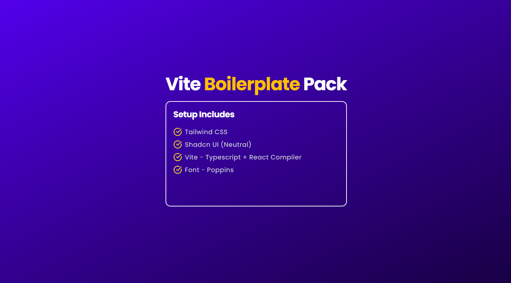

# 🚀 Vite + Typescript - Bolilerplate

A **ready-to-use vite boilerplate** built with modern best practices.  
Designed for day-to-day projects like **Website Building, Single-Page Application, SaaS App, etc.**.



### 🧱 Tech Stack

- **React 19**
- **Vite v7.2**
- **Tailwind 4**
- **Typescript 5**
- **Font - Poppins**
- **Shadcn/UI - Neutral**
- **React Icons v5.5**
- Custom Hooks

## 📁 Project Structure

```
vite-boilerplate/
|
├── public/ # Assets like images, icons, etc.
├── src/ 
│ ├── assets/
│ ├── components
| |   └── ui/
│ ├── hooks
│ |   ├── index.tsx
│ |   ├── useBrowserStorage.tsx
│ |   ├── useIsMobile.tsx
│ |   └── useOnlineStatus.tsx
│ ├── lib
│ |   ├── constants.ts
| |   └── utils.ts
│ ├── types
| |   └── index.ts
│ ├── App.css
│ ├── App.tsx
│ ├── index.css
│ └── main.tsx
├── .gitignore
├── components.json
├── eslint.config.js
├── index.html
├── package-lock.json
├── package.json
├── README.md
├── tsconfig.app.json
├── tsconfig.json
├── tsconfig.node.json
└── vite.config.ts
```
## 🧠 Included Hooks

| Hook | Description |
|----|------------|
| `useBrowserStorage` | Safe local & session storage access |
| `useIsMobile` | Viewport-based mobile detection |
| `useOnlineStatus` | To check Online/Offline status |

## ⚙️ Commands to run the app

In order to run the code follow below steps:

```
git clone https://github.com/Nikhil1602/vite-boilerplate.git
cd vite-boilerplate
npm i
npm run dev
```